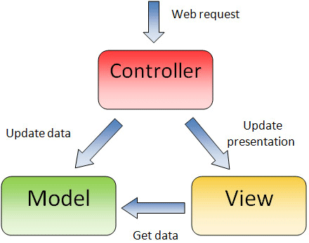
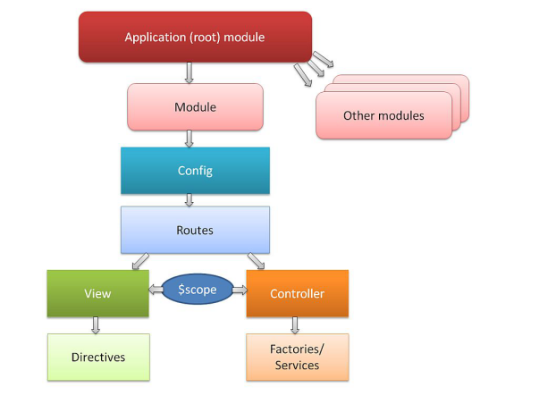
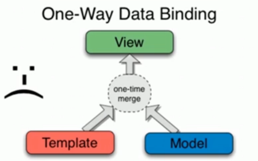
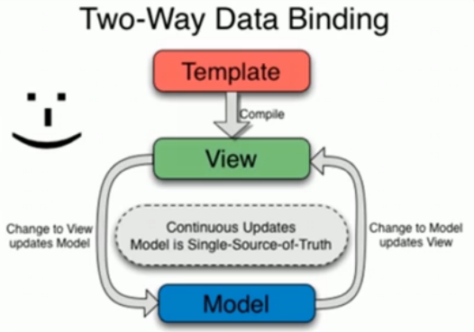
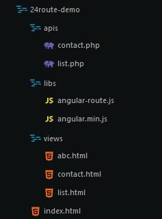

## 一、Angular 简介

### 介绍
- 一款非常优秀的前端高级 JS 框架
- 最早由 Misko Hevery 等人创建
- 2009 年被 Google 公式收购，用于其多款产品
- 目前有一个全职的开发团队继续开发和维护这个库
- 有了这一类框架就可以轻松构建 SPA 应用程序
- 轻松构建 SPA（单一页面应用程序）

<!-- more -->
- 单一页面应用程序：
  + 只有一个页面（整个应用的一个载体）
  + 内容全部是由AJAX方式呈现出来的
- 其核心就是通过指令扩展了 HTML，通过表达式绑定数据到 HTML。
- 类似的相关框架还有BackBone、KnockoutJS、Vue、React等。
- 更少的代码，实现更强劲的功能
- 将一些以前在后台开发中使用的思想带入前端开发
- 带领当前市面上的框架走向模式化或者架构化

### AngularJS 的核心特性
- MVC
- 模块化
- 自动化双向数据绑定
- 指令系统

### 相关链接
- http://www.apjs.net/
- http://www.angularjs.cn/
- http://docs.angularjs.cn/api
- https://material.angularjs.org
- http://angular-ui.github.io/

### 下载安装
> 每种方式安装包，本质都是将angular的库下载到当前文件夹中

- 通过github下载：
	+ https://github.com/angular/angular.js/releases
- 使用 CDN 上的 Angular.js：
  	+ http://apps.bdimg.com/libs/angular.js/1.4.9/angular.min.js
- 使用 bower 安装：
  	+ bower install angular
- 使用 npm 安装：
  	+ npm install angular

### 体验AngularJS
```HTML
<!DOCTYPE html>
<html lang="en">
<head>
	<meta charset="UTF-8">
	<title>体验angularJS</title>
</head>
<body ng-app='DemoApp'>
	<input type="text" ng-model="msg">
	<h2>{{msg}}</h2>
	<!-- 引入angularJS框架 -->
	<script src="./libs/angular.js"></script>
	<script type="text/javascript">
		var App = angular.module('DemoApp', []);
		App.controller('DemoController', ['$scope', function($scope){
			$scope.msg = 'Hello,World!';
		}]);
	</script>
</body>
</html>
```

### MVC简介
> MVC是一种开发模式，由模型（Model）、视图（View）、控制器（Controller）3部分构成，采用这种开发模式为合理组织代码提供了方便、降低了代码间的耦合度、功能结构清晰可见。

- 模型（Model）一般用来处理数据（读取/设置），一般指操作数据库。
- 视图（View）一般用来展示数据，比如通过HTML展示。
- 控制器（Controller）一般用做连接模型和视图的桥梁。



## 二、AngularJS模块化
> 使用AngularJS构建应用（App）时是以模块化（Module）的方式组织的，即将整个应用划分成若干模块，每个模块都有各自的职责，最终组合成一个整体。
> 采用模块化的组织方式，可以最大程度的实现代码的复用。

### 定义应用
> 通过为任一HTML标签添加ng-app属性，可以指定一个应用，表示此标签所包裹的内容都属于应用（App）的一部分。

```HTML
<!-- 为body标签添加ng-app标整个文档都是被应用管理 -->
<!-- ng-app属性可以不赋值，但是要关联相应模块时则必须赋值 -->
<body ng-app='DemoApp' width="500px" height="400px">
```

### 定义模块
> AngularJS提供了一个全局对象angular，在此全局对象下存在若干的方法，其中angular.module()方法用来定义一个模块。

```HTML
<!-- 通过module方法定义模块 -->
<!-- 需要传递两个参数，第一个参数表示模块的名称，第二个参数表示此模块依赖的其他模块 -->
var App = angular.module('DemoApp', []);
```

### 定义控制器
> 控制器（Controller）作为连接模型（Model）和视图（View）的桥梁存在，所以当我们定义好了控制器以后也就定义好了模型和视图。

```javascript
// app是一个模块实例对象
// 通过这个实例对象定义控制器
// 需要两个参数，第一个参数表示控制器的名称，第二个参数是一个数组，这个数组最后一个元素是一个函数，其他都是字符串，标明此控制器的依赖关系。
app.controller('StudentController', ['$scope', function($scope) {
}]);

```

> 模型（Model）数据是要展示到视图（View）上的，所以需要将控制器（Controller）关联到视图（View）上，通过为HTML标签添加ng-controller属性并赋值相应的控制器（Controller）的名称，就确立了关联关系。

```html
<table ng-controller="StudentController">
	<tr><th>姓名</th><th>性别</th><th>年龄</th></tr>
	<tr ng-repeat="item in students">
		<td>{{item.name}}</td>
		<td>{{item.sex}}</td>
		<td>{{item.age}}</td>
	</tr>
</table>
```
> 以上步骤就是AngularJS最基本的MVC工作模式。
> 下图是AngularJS的结构，学习AngularJS会围绕下图的结构展开。




## 三、AngularJS指令系统

### 指令（Directive）介绍
- AngularJS有一套完整的、可扩展的、帮助web应用开发的指令集
- 在DOM编译期间，和HTML关联着的指令会被检测到，并且被执行
- 在AngularJS中将前缀为ng- 这种属性称之为指令，其作用就是为DOM元素调用方法、定义行为、绑定数据等
- 简单说： 当一个Angular应用启动，Angular就会遍历DOM树来解析HTML，根据指令的不同，完成不同的操作。
- HTML5中允许扩展（自定义的）属性，以data-开头
- AngularJS属性以ng-开头，但是您可以使用data-ng-来让网页对HTML5有效，二者效果相同。

<a href="./Angular指令系统.md"></a>

### 内置指令

##### 1.ng-app 指定应用根元素，至少有一个元素指定了此属性。
	+ ng-app指令用来标明一个AngularJs应用程序
	+ 标记在一个AngularJs的作用范围根对象上
	+ 系统执行时会自动的执行根对象范围内的其他指令
	+ 可以在一个页面上创建多个ng-app指令节点

	```HTML
	<body ng-app='DemoApp' width="500px" height="400px">
	```

##### 2.ng-controller 指定控制器

```html
	<table ng-controller="StudentController">
		<tr><th>姓名</th><th>性别</th><th>年龄</th></tr>
		<tr ng-repeat="item in students">
			<td>{{item.name}}</td>
			<td>{{item.sex}}</td>
			<td>{{item.age}}</td>
		</tr>
	</table>

	app.controller('StudentController', ['$scope', function($scope) {
		$scope.students = [
			{name: 'havenxie', sex: 'man', age: 25},
			{name: 'nickwei', sex: 'man', age: 23},
			{name: 'beilong', sex: 'man', age: 24}
		];
	}]);
```
##### 3.ng-show控制元素是否显示，true显示、false不显示
##### 4.ng-hide控制元素是否隐藏，true隐藏、false不隐藏
> ng-show/ng-hide指令会根据属性值去确定是否展示当前元素，例如ng-show = false则不会展示该元素,但是元素是存在的只是没有显示而已。

```html
	<ul class="messages">
		<li ng-repeat="item in messages track by $index" ng-show="item.read">
			{{item.content}}
		</li>
	</ul>
```

##### 5.ng-if控制元素是否“存在”，true存在、false不存在
> 如果值为false则这个元素不会存在，即DOM中不会有这个元素。

##### 6.ng-src增强图片路径
##### 7.ng-href增强地址
> ng-link/ng-src指令用于解决当连接类型数据绑定时造成的加载bug，如

```html
	<!-- 浏览器在解析html时会去请求{{item.url}}文件,这样会造成请求失败的bug -->
	
	<!-- 可以使用ng-src指令来解决这个问题 -->
	
```

##### 8.ng-class控制类名
> ng-class指令可以设置一个键值对，用于决定是否添加一个特定的类名，键为class名，值为bool类型表示是否添加该类名

```html
	<ul class="message">
		<li ng-repeat="item in messages track by $index" ng-class="{red: item.read}">
			{{item.content}}
		</li>
	</ul>
```

##### 9.ng-repeat指令
> ng-repeat指令用来编译一个数组重复创建当前元素，如

```html
	<ul class="message">
		<li ng-repeat="item in message track by $index">
			{{item}}
		</li>
	</ul>
```

##### 10.ng-switch配合ng-repeat进行数据过滤
```html
	<div ng-controller="DemoController">
		<ul>
			<li ng-repeat="item in items" ng-switch on="item">
				<span ng-switch-when="css">{{item}}</span><!--只有item是css的时候才会显示span-->
			</li>
		</ul>
	</div>
	<script type="text/javascript">
		var App = angular.module('DemoApp', []);
		App.controller('DemoController', ['$scope', function($scope){
			items = ['html', 'css', 'js'];
		}]);
	</script>
```

##### 11.ng-include引入模板
> 引入其他文件的html模块,并放在该标签内

```html
	<div ng-include="./header.html" scope="" onload=""></div>
	--------------------------------------------------------------
	<!-- 其他模块 -->
	<header>hello，world!</header>
```

##### 12.ng-disabled表单禁用
##### 13.ng-readonly表单只读
##### 14.ng-checked单/复选框表单选中
##### 15.ng-selected下拉框表单选中
##### 16.事件扩展 ng-click 、ng-dblclick、ng-blur...

```html
	<div ng-controller="DemoController">
		<button ng-click="test()">单击</button>
		<button ng-dblclick="test2()">双击</button>
	</div>
	<script type="text/javascript">
		var App = angular('DemoApp', []);
		App.controller('DemoController', ['$scope', function($scope){
			$scope.test = function() {
				alert('Hello,World!');
			};
			$scope.test2 = function() {
				alert('我被双击了');
			};
		}]);
	</script>
```

##### 17.ng-bind、{{xxx}} 和 ng-bind-template三者实现单项绑定


- {{xxx}}是ng-bind的简写形式
- 同一个标签上可以使用多个{{xxx}}，而只能使用一个ng-bind
- 页面刚刷新时，ng-bind不会出现瞬间显示{{xx}}的bug
- 解决页面刚加载时候页面显示{{xxx}}的bug：
	+ 将Angular.js添加到head标签尾部，在使用{{xxx}}的标签上添加ng-clock指令
	+ 手动在head标签处添加angular的bug修复css样式，在使用{{xxx}}的标签上添加ng-clock指令。 
- ng-bind-template可以绑定多个数据：`<div ng-bind-template="{{xxx}}{{xxx}}"></div>`

##### 18.ng-model 双向数据绑定
> 需要借助表单元素并且只能是表单元素

##### 19.ng-init 初始化数据（作用和控制器中初始化相同）
```html
<div ng-controller="DemoController" ng-init="name='havenxie';age=25">
	<h1>{{test}}</h1>
</div>
```

### 自定义指令
> AngularJS中可以通过代码自定义指令：

```javascript
//自定义指令hello
//使用：<div hello></div>//将会使指令的template代替div标签
myModule.directive('hello', function() {
	return {
		restrict: 'E',	//'E'当做元素来使用,'A'当做属性来使用，'C'当做class来使用，'M'当做注释来使用。
		template: '<h1>Hello,World</h1>',
		<!-- templateUrl: '外部html代码段路径' --><!--需要html服务器架起-->
		replace: true
	};
});
myApp.directive('ngHover', function() {
	return function(scope, element, attr) {
		element.bind("mouseenter", function() {
			element.css('background', 'yellow');
		});
		element.bind('mouseleave', function() {
			element.css('background', 'none');
		});
	}
});
```


## 四、AngularJS数据绑定
> AngularJS是以数据做为驱动的MVC框架，所有模型（Model）里的数据经由控制器（Controller）展示到视图（View）中。
> 所谓数据绑定指的就是将模型（Model）中的数据与相应的视图（View）进行关联，分为单向绑定和双向绑定两种方式。

### 4.1单向数据绑定
> 如下图所示，只能模型（Model）数据向视图（View）传递。

- 模型变化过后，自动同步到界面上
- 一般纯展示形的数据会用到单项数据绑定
- 使用表达式的方式都是单向的



### 4.2双向数据绑定
> 双向绑定则可以实现模型（Model）数据和视图（View）模板的双向传递，如下图所示。

- 两个方向的数据会自动同步
- 模型发生变化会自动同步到视图上
- 视图上的数据变化过后会自动同步到模型上



### 4.3相关指令
- 在AngularJS中通过“{{xxx}}”和ng-bind指令来实现模型（Model）数据向视图模板（View）的绑定
- “{{xxx}}”是ng-bind的简写形式，其区别在于通过“{{xxx}}”绑定数据时会有“闪烁”现象
- 添加ng-cloak也可以解决“闪烁”现象(需要将angularjs脚本提前或者引入angularjs的css)，通过ng-bind-template可以绑定多个数据。

```html
	<body ng-app="App">
	    <ul ng-controller="DemoController">
	        <li ng-bind="name"></li>
	        <li ng-cloak>{{name}}{{age}}</li>
	        <li ng-bind-template="{{name}}{{age}}"></li>
	    </ul>
	    <script src="./libs/angular.min.js"></script>
	    <script>
	        var App = angular.module('App', []);
	        App.controller('DemoController', ['$scope', function ($scope) {
	            $scope.name = 'havenxie';
	            $scope.age = 10;
	        }]);
	    </script>
	</body>
```

- 通过为表单元素添加ng-model指令实现视图（View）模板向模型（Model）数据的绑定。

```html
	<body ng-app="App">
	    <div ng-controller="DemoController">
	        <input type="text" ng-model="msg">
	        <h4>{{msg}}</h4>
	        <button ng-click="show()">显示</button>
	    </div>
	    <script src="./libs/angular.min.js"></script>
	    <script>
	    	var App = angular.module('App', []);
	        App.controller('DemoController', ['$scope', function ($scope) {
	            $scope.show = function () {
	                alert($scope.msg);
	            }
	        }]);
	    </script>
	</body>
```

- 通过ng-init可以初始化模型（Model）也就是$scope。

```html
	<body>
		<div ng-controller="DemoController" ng-init="name='havenxie';age=25">
			<h1>{{name}}</h1>
			<h2>{{age}}</h2>
		</div>
		<script src="./libs/angular.min.js"></script>
		<script>
			var App = angular.module('App', []);
			App.controller('DemoController', ['$scope', function ($scope){
			}]);
		</script>
	</body>
```

- AngularJS对事件也进行了扩展，无需显式的获取DOM元素便可以添加事件，易用性变的更强。通过在原有事件名称基础上添加ng-做为前缀，然后以属性的形式添加到相应的HTML标签上即可。如ng-click、ng-dblclick、ng-blur等。

```html
	<body>
		<div ng-controller="DemoController">
			<ul style="list-style: none;">
				<li><button ng-click="single()">单击</button></li>
				<li><button ng-dblclick="double()">双击</button></li>
				<li><input type="text" ng-blur="blur()"></li>
				<li ng-mouseout="mouseout()">一些内容</li>
			</ul>
		</div>
		<script src="./libs/angular.min.js"></script>
		<script>
			var App = angular.module('App', []);
			App.controller('DemoController', ['$scope', function ($scope) {
				$scope.single = function () {
					alert('我被单击了');
				};
				$scope.double = function () {
					alert('我被双击了');
				};
				$scope.blur = function () {
					alert('失去焦点了');
				};
				$scope.mouseout = function () {
					alert('鼠标移出了');
				};
			}]);
		</script>
	</body>
```

## 五、AngularJS作用域

### 根作用域
> 一个AngularJS的应用（App）在启动时会自动创建一个根作用域$rootScope，这个根作用域在整个应用范围（ng-app所在标签以内）都是可以被访问到的。

```html
<!-- 指定一个普通的div为应用的根元素，这个根元素对应的便是$rootScope -->
<!-- 通过ng-init为$rootScope添加数据 -->
	<body ng-app="App" ng-init="name='顺治'"><!--在根作用域上-->
		<div class="parent" ng-controller="ParentController">
			<h1>{{name}}</h1>
			<div class="child" ng-controller="ChildController">
				<h2>{{name}}</h2>
			</div>
		</div>
		<script src="angular.min.js"></script>
		<script>
			var App = angular.module('App', []);
			App.controller('ParentController', ['$scope', function ($scope) {
				// $scope.name = '康熙';
			}]);
			App.controller('ChildController', ['$scope', function ($scope) {
				$scope.name = '雍正';
			}]);
		</script>
	</body>
```

### 子作用域
> 通过ng-controller指令可以创建一个子作用域，新建的作用域可以访问其父作用域的数据。

## 六、AngularJS过滤器
> 在AngularJS中使用过滤器格式化展示数据，在“{{xxx}}”中使用“|”来调用过滤器，使用“:”传递参数。
> 一般用于服务端存储的数据装换为用户界面可以理解的数据

### 内置过滤器
1. currency将数值格式化为货币格式
2. date日期格式化，年（y）、月（M）、日（d）、星期（EEEE/EEE）、时（H/h）、分（m）、秒（s）、毫秒（.sss），也可以组合到一起使用。
3. filter在给定数组中选择满足条件的一个子集，并返回一个新数组，其条件可以是一个字符串、对象、函数
4. json将Javascrip对象转成JSON字符串。
5. limitTo取出字符串或数组的前（正数）几位或后（负数）几位
6. lowercase将文本转换成小写格式
7. uppercase将文本转换成大写格式
8. number数字格式化，可控制小位位数
9. orderBy对数组进行排序，第2个参数可控制方向

```html
<body ng-app="DemoApp">
	<ul ng-controller="DemoController">
		<li>{{price | currency: '￥'}}</li><!--通过后面的冒号进行传参-->
		<li>{{time | date}}</li><!--默认英文格式的时间-->
		<li>{{time | date: 'yyyy-MM-dd hh:mm:ss'}}</li>
		<li>{{items | filter: 's'}}</li><!--过滤只带's'的-->
		<li>{{students | filter: {age: 17}}}</li><!--过滤出那个年龄是17的孩子-->
		<li>{{students | filter: json}}</li><!--以json格式显示-->
		<li>{{items | limitTo: 1}}</li><!--取出字符串或数组的前多少个-->
		<li>{{str | uppercase}}</li><!--转换成大写字母-->
		<li>{{str | lowercase}}</li><!--转换成小写字母-->
		<li>{{num | number}}</li><!--默认保留三位小数 四舍五入-->
		<li>{{num | number: 4}}</li><!--表示要保留两位小数-->
		<li>{{items | orderBy}}</li><!--排序，默认按照ascii码-->
		<li>{{items | orderBy: '': true}}</li><!--倒序 true从大到小，false从小到大-->
		<li>{{students | orderBy: 'name' : true}}</li><!--按照名字的ASCII码从打到小排序-->
		<li>{{students | orderBy: 'age' : false}}</li><!--按照年龄从小到大排序-->
	</ul>
</body>
-----------------------------------------------------
var App = angular.module('DemoApp', []);
App.controller('DemoController',['$scope', function($scope) {
	$scope.price = 11.11;
	$scope.time = new Date();
	$scope.items = ['html', 'css', 'js'];
	$scope.students = [
		{name: '小红', age: 18}, 
		{name: '小明', age: 19}, 
		{name: '小米', age: 17}];
	$scope.str = 'Hello,AngularJs';
	$scope.num = 10.2345;
}]);
```

10. limitTo 过滤器用于限制一个字符串或数组展示的长度

```html
<ul class="messages">
	<li ng-repeat="item in messages | limitTo:2">
		{{item.content | limitTo: 2}}
	</li>
</ul>
```

### 自定义过滤器
> 除了使用AngularJS内建过滤器外，还可以根据业务需要自定义过滤器，通过模块对象实例提供的filter方法自定义过滤器。

```html
<body ng-app="DemoApp">
	<div ng-controller="DemoController">
		<h4>{{info}}:{{havenxie | DemoFilter}}</h4>
	</div>
</body>
```

```javascript 
var App = angular.module('DemoApp',[]);
App.controller('DemoController',['$scope', function($scope) {
	$scope.name = 'havenxie';
	$scope.info = 'my name is';
}]);
App.filter('DemoFilter', function() { //定义一个过滤器实现首字母大写
	return function(input) {//接收|前面的数据
		return input[0].toUpperCase() + input.slice(1);
	};
});
```

## 七、AngularJS依赖注入
> 所谓依赖注入是指在运行时自动查找依赖关系，然后将查找到依赖传递给使用者的一种机制。常见的AngularJS内置服务有$http、$location、$timeout、$rootScope等。

### 推断式注入
> 没有明确声明依赖，AngularJS会将函数参数名称当成是依赖的名称。这种方式会带来一个问题，当代码经过压缩后函数的参数被压缩，这样便会造成依赖无法找到。

```html
<body ng-app="App">
	<div class="box" ng-controller="DemoController"></div>
	<script src="./libs/angular.min.js"></script>
	<script>
		var App = angular.module('App', []);
		// 推断式依赖注入
		App.controller('DemoController', function ($scope, $http) {
		});
	</script>
</body>
```

### 行内注入
> 以数组形式明确声明依赖，数组元素都是包含依赖名称的字符串，数组最后一个元素是依赖注入的目标函数。
> 推荐使用这种方式声明依赖

```html
<body ng-app="App">
	<div ng-controller="DemoController">
		<h3>{{name}}</h3>
	</div>
	<script src="./libs/angular.min.js"></script>
	<script>
		var App = angular.module('App', []);
		// 行内式注入
		App.controller('DemoController', ['$scope', '$http', function (abc, bcd) {
			abc.name = '依赖注入';
		}]);
	</script>
</body>
```

## 八、AngularJS服务
> 服务是一个对象或函数，对外提供特定的功能。

### 内置服务
##### 1.$location是对原生Javascript中location对象属性和方法的封装。

```html
<body>
	<dl ng-controller="DemoController">
		<dt>{{title}}</dt>
		<dd>absUrl: {{absUrl}}</dd>
		<dd>url: {{url}}</dd>
		<dd>host: {{host}}</dd>
		<dd>search: {{search}}</dd>
		<dd>hash: {{hash}}</dd>
		<dd>protocol: {{protocol}}</dd>
		<dd>port: {{port}}</dd>
	</dl>
	<script src="angular.min.js"></script>
	<script>
		var App = angular.module('App', []);
		// AngularJS 专门提供了一个帮你获URL地址一个服务$location
		App.controller('DemoController', ['$scope', '$location', function($scope, $location) {
			$scope.title = '学习$location服务';
			$scope.absUrl = $location.absUrl();// 绝对路径
			$scope.url = $location.url();
			$scope.host = $location.host();
			$scope.search = $location.search();// 查询字符串
			$scope.hash = $location.hash();
			$scope.protocol = $location.protocol();// 协议
			$scope.port = $location.port();// 端口
		}]);
		for(var key in location) {//window对象的子对象
			console.log(key + '=>' + location[key]);
		}
	</script>
</body>
```

##### 2.$timeout和$interval对原生Javascript中的setTimeout和setInterval进行了封装。
```html
<body>
	<div ng-controller="DemoController">
		<ul style="list-style: none">
			<li>{{msg}}</li>
			<li>{{now|date: 'yyyy-MM-dd hh:mm:ss'}}</li>
			<li><button ng-click="stop()">停</button></li>
		</ul>
	</div>
	<script src="angular.min.js"></script>
	<script>
		var App = angular.module('App', []);
		App.controller('DemoController', ['$scope', '$timeout', '$interval',function ($scope, $timeout, $interval) {
			$timeout(function () {
				$scope.msg = '执行了';
			}, 3000);
			var timer = $interval(function () {
				$scope.now = new Date;
			}, 1000);
			$scope.stop = function () {
				$interval.cancel(timer);
			};
		}]);
	</script>
</body>
```

##### 3.$filter格式化数据。
```html
<body>
	<ul ng-controller="DemoController">
		<li>价格: {{price}}</li>
		<li>大写：{{str}}</li>
		<li>截取: {{str1}}</li>
	</ul>
	<script src="angular.min.js"></script>
	<script>
		var App = angular.module('App', []);
		App.controller('DemoController', ['$scope', '$filter', function ($scope, $filter) {
			// $filter是九种过滤器中任何一个
			$scope.price = 11.11;
			var currency = $filter('currency');//创建currency过滤器
			$scope.price = currency($scope.price);//开始过滤数据
			$scope.str = 'hello angular';
			var uppercase = $filter('uppercase');//创建过滤器
			$scope.str = uppercase($scope.str);//开始过滤数据
			$scope.str1 = $filter('limitTo')($scope.str, 2);
		}]);
	</script>
</body>
```

##### 4.$log日志打印调试信息
```javascript
var App = angular.module('DemoApp', []);
App.controller('DemoController', ['$scope', '$log', function($scope, $log) {
	$log.info('普通信息');
	$log.warn('警告信息');
	$log.error('错误信息');
	$log.log('打印信息');
	$log.debug('调试信息');
}]);
```

##### 5.$http用于向服务端发起异步请求。
> $http 本质是对XMLHttpRequest对象封装
> $http服务是AngularJS中处理Ajax的服务
> 同时还支持多种快捷方式如$http.get()、$http.post()、$http.jsonp。

```html
<body ng-app="App">
	<div ng-controller="DemoController"></div>
	<script src="angular.min.js"></script>
	<script>
		var App = angular.module('App', []);
		App.controller('DemoController', ['$scope', '$http', '$log', function ($scope, $http, $log) {
			$http({
				url: 'example.php',
				method: 'post',// method: 'get',
				headers: {
					'Content-Type': 'application/x-www-form-urlencoded'
				},
				params: { // get 参数
					name: 'itcast',
					sex: '男'
				},
				// data: 'age=10'
				data: { // post 传参
					age: 10
				}
			}).success(function (info) {
				$log.info(info);
			});
		}]);
		// 传递的数据可以是'key=val&key=val'形式，这种形式叫formData
		// Content-Type 设成 application/x-www-form-urlencoded
		// 当请求数据类型不一样，后端在接收的时采取方法也不一样
		// 假如上述方式以PHP为例可以使用$_POST接收
		// application/json;charset=UTF-8 就是json对象形式传
		// Request Payload
		// 假如采用上述方式，以PHP为例$_POST就不能接收了
	</script>
</body>
```

> 传递的数据可以是'key=val&key=val'形式，这种形式叫formData
Content-Type设置成application/x-www-form-urlencoded
当请求数据类型不一样，后端在接收的时候才去方式也不一样
假如上述方式以PHP为例可以使用$POST接收

> application/json;charset=UTF-8 就是json对象形式传递
Request Payload
假如采用上述方式，以PHP为例$_POST就不能接收了。

例子：获取明星数据：

```html
<body ng-app="App">
	<div ng-controller="StarController">
		<button ng-click="getData()">获取数据</button>
		<table>
			<tr>
				<td>姓名</td>
				<td>年龄</td>
				<td>性别</td>
				<td>头像</td>
				<td>专辑</td>
			</tr>
			<tr ng-repeat="star in stars">
				<td>{{star.name}}</td>
				<td>{{star.age}}</td>
				<td>{{star.sex}}</td>
				<td>{{star.photo}}</td>
				<td>{{star.ablum}}</td>
			</tr>
		</table>
	</div>
	<script src="angular.min.js"></script>
	<script>
		var App = angular.module('App', []);
		App.controller('StarController', ['$http', '$scope', '$log', function ($http, $scope, $log) {
			$scope.getData = function () {
				$http({
					url: './stars.php',
					method: 'get'
				}).success(function (info) {
					$scope.stars = info;
				});
			}
		}]);
	</script>
</body>
```

```php
<?php
// php代码要放在php环境中运行
	$result = file_get_contents('./stars.json');
	echo $result;
?>
```

```json
[{//json数据
	"name": "王力宏",
	"photo": "./images/wlh.jpg",
	"ablum": "<<改变自已>>",
	"age": 39,
	"sex": "男"
}, {
	"name": "刘德华",
	"photo": "./images/wlh.jpg",
	"ablum": "<<忘情水>>",
	"age": 42,
	"sex": "男"
}]
```

### 自定义服务
> 所谓服务是将一些通用性的功能逻辑进行封装方便使用，AngularJS允许将自定义服务。

##### 方法1. factory方法
```html
<body>
	<div ng-controller="DemoController">
		<span>{{now}}</span>
	</div>
	<script src="angular.min.js"></script>
	<script>
		var App = angular.module('App', []);
		// 定义一个名叫showTime的服务
		App.factory('showTime', ['$filter', function ($filter) {
			/*return function () {
				var now = new Date();
				var date = $filter('date');
				return date(now, 'y-M-d H:m:s');
			}*/
			var now = new Date();
			var date = $filter('date');
			return {
				now: date(now, 'yyyy-MM-dd H:m:s')
			}
		}]);
		App.controller('DemoController', ['$scope', 'showTime', function($scope, showTime) {
			// $scope.now = showTime();
			$scope.now = showTime.now;
		}]);
	</script>
</body>
```

##### 方法2. service方法
```html
<body>
	<div ng-controller="DemoController">
		<h1>{{now}}</h1>
	</div>
	<script src="./libs/angular.min.js"></script>
	<script>
		var App = angular.module('App', []);
		// 自定义服务显示日期
		App.service('showTime', ['$filter', function($filter) {
			var now = new Date();
			var date = $filter('date');
			this.now = date(now, 'yyyy-MM-dd HH:mm:ss');//这里用this，不需要return
		}]);
		App.controller('DemoController', ['$scope', 'showTime', function($scope, showTime) {
			$scope.now = showTime.now;
		}]);
	</script>
</body>
```

##### 方法3. value方法定义常量
```html
<body>
	<div ng-controller="DemoController">
		{{author}}版本：{{ver}}
	</div>
	<script src="angular.min.js"></script>
	<script>
		var App = angular.module('App', []);
		// 自定义常量服务
		App.value('author', 'itcast');
		App.value('version', '1.0');
		// 从表现形式上是一个常量
		App.controller('DemoController', ['$scope', 'author', 'version', function($scope, author, version) {
			$scope.author = author;
			$scope.ver = version;
		}]);
	</script>
</body>
```

## 九、AngularJS模块加载
> AngularJS模块可以在被加载和执行之前对其自身进行配置。我们可以在应用的加载阶段配置不同的逻辑。

### 配置块
- 通过config方法实现对模块的配置，AngularJS中的服务大部分都对应一个“provider”，用来执行与对应服务相同的功能或对其进行配置。
- $log、$http、$location都是内置服务，相对应的“provider”分别是$logProvider、$httpProvider、$locationPorvider。

以$log和$filter为例，修改他的配置

```javascript
<body>
	<div ng-controller="DemoController">
		<h1>{{now}}</h1>
		<h2>{{str|capitalize}}</h2>
	</div>
	<script src="angular.min.js"></script>
	<script>
		var App = angular.module('App', []);
		// 配置$log服务(禁用debug)允许一次配置多个，需要引入配置服务
		App.config(['$logProvider', '$filterProvider', function ($logProvider, $filterProvider) {
			// 禁用debug功能
			$logProvider.debugEnabled(false);

			// 默认9个过滤器，通过配置可以新增一些过滤器
			$filterProvider.register('capitalize', function () {// 新增一个过滤器
				return function (input) {
					return input[0].toUpperCase() + input.slice(1);
				};
			});
		}]);
		App.controller('DemoController', ['$scope', '$log', function ($scope, $log) {
			$log.debug('debug');// 测试配置后的结果
			$scope.str = 'hello angular';
		}]);
	</script>
</body>
```

### 运行块
> 服务以模块形式存在对外提供特定功能，上面都是将服务做为依赖注入进去的，然后再进行调用，除此之外我们也可以直接运行相应的服务模块，AngularJS提供了run方法来实现。

```html
<body ng-app="App">
	<div ng-controller="DemoController">{{name}}</div>
	<script src="angular.min.js"></script>
	<script>
		var App = angular.module('App', []);
		// 直接运行$http、$rootScope服务
		App.run(['$http', '$rootScope', function ($http, $rootScope) {
			$http({// 直接调用$http
				url: 'example.php',
				method: 'get'
			}).success(function(data) {
				console.log(data);
			});
			// 根作用域
			$rootScope.name = '祖宗';
		}]);
		App.controller('DemoController', ['$scope', function($scope) {
			$scope.name = '后代';
		}]);
	</script>
</body>
```

```php
<?php
	echo 'Hello,World!';
?>
```

> run方法还是最先执行的，利用这个特点我们可以将一些需要优先执行的功能通过run方法来运行，比如验证用户是否登录，未登录则不允许进行任何其它操作。


## 十、AngularJS路由
> 一个应用是由若干视图组合而成的，根据不同的业务逻辑展示给用户不同的视图，路由则是实现这一功能的关键。

### SPA介绍
> SPA（Single Page Application）指的是通单一页面展示所有功能，通过Ajax动态获取数据然后进行实时渲染，结合CSS3动画模仿原生App交互，然后再进行打包（使用工具把Web应用包一个壳，这个壳本质上是浏览器）变成一个“原生”应用。

> 在PC端也有广泛的应用，通常情况下使用Ajax异步请求数据，然后实现内容局部刷新，局部刷新的本质是动态生成DOM，新生成的DOM元素并没有真实存在于文档中，所以当再次刷新页面时新添加的DOM元素会“丢失”，通过单页面应可以很好的解决这个问题。

### 路由
> Web应用中又经常通过链接（a标签）来更新页面（视图），当点击链接时还要阻止其向服务器发起请求，通过锚点（页内跳转）可以实现这一点。

实现单页面应用需要具备：
1. 只有一页面
2. 链接使用锚点
```html
<!DOCTYPE html>
<html lang="en">
<head>
	<meta charset="UTF-8">
	<title>AngularJS 路由和多视图</title>
	<style>
		body {
			padding: 0;
			margin: 0;
			background-color: #F7F7F7;
			font-family: Arial;
		}
		.wrapper {
			width: 980px;
			margin: 50px auto;
		}
		ul {
			padding: 0;
			margin: 0;
			overflow: hidden;
			list-style: none;
			background-color: #000;
			border-radius: 4px;
		}
		li {
			float: left;
			width: 120px;
			height: 40px;
			text-align: center;
			line-height: 40px;
			font-size: 18px;
		}
		li.active {
			background-color: #333;
		}
		li a {
			display: block;
			color: #FFF;
			text-decoration: none;
		}
		.content {
			margin-top: 30px;
			font-size: 24px;
			padding: 0 20px;
		}
	</style>
</head>
<body>
	<div class="wrapper">
		<ul>
			<li class="active"><a href="#index">Index</a></li>
			<li><a href="#introduce">Introduce</a></li>
			<li><a href="#contact">Contact Us</a></li>
		</ul>
		<div class="content">
			Index Page
		</div>
	</div>
	<script>
		// 监听锚点变化然后发送请求// hashchange事件可以监听锚点变化
		window.addEventListener('hashchange', function () {
			// 获取锚点
			var hash = location.hash;
			// 处理#
			hash = hash.slice(1);
			// 实例对象
			var xhr = new XMLHttpRequest;
			// 将锚点做为参数传递给服务端进处理
			xhr.open('get', '10-01.php?hash=' + hash);
			xhr.send(null);
			xhr.onreadystatechange = function () {
				if(xhr.readyState == 4 && xhr.status == 200) {
					var result = xhr.responseText;
					// 将返回结果添加到页面
					document.querySelector('.content').innerHTML = result;
				}
			};
		});
	</script>
</body>
</html>
```

> 通过上面的例子发现在单一页面中可以能过hashchange事件监听到锚点的变化，进而可以实现为不同的锚点准不同的视图，单页面应用就是基于这一原理实现的。

> AngularJS对这一实现原理进行了封装，将锚点的变化封装成路由（Route）,这是与后端路由的根本区别。

> 在1.2版前路由功能是包含在AngularJS核心代码当中，之后的版本将路由功能独立成一个模块，需要单独下载angular-route.js

#### 使用
1. 引入angular-route.js
	```javascript
	<script type="text/javascript" src="angular.js"></script>
	<script type="text/javascript" src="angular-route.js"></script>
	```

2. 实例化模块时，载入ngRoute模块
	```javascript
	var App = angular.module('DemoApp', ['ngRoute']);
	```

3. 配置路由模块
	```javascript
	App.config('$routeProvider', function($routeProvider) {
		$routeProvider.when('/', {
			template: '首页'
		});
	});
	```

4. 布局模板
> 通过ng-view指令布局模板，路由匹配的视图会被加载渲染到些区域。

	```html
	<header>头部</header>
	<div class="container">
		<!-- 视图将会被加载并渲染到此处 -->
		<div ng-view></div>
	</div>
	<footer>底部</footer>
	```

#### 路由参数
- 提供两个方法匹配路由，分别是when和otherwise，when方法需要两个参数，otherwise方法做为when方法的补充只需要一个参数，其中when方法可以被多次调用。
- 第1个参数是一个字符串，代表当前URL中的hash值。
- 第2个参数是一个对象，配置当前路由的参数，如视图、控制器等。
	+ template 字符串形式的视图模板
	+ templateUrl 引入外部视图模板
	+ controller 视图模板所属的控制器
	+ redirectTo跳转到其它路由

```javascript
.when('index/:id', {
	template: 'Index Page!',
	controller: 'IndexController'
})
```

- 获取参数，在控制中注入$routeParams可以获取传递的参数

```javascript
App.controller('IndexController', ['$scope', '$routeParams', function($scope, $routeParams) {
	console.log($routeParams);
}]);
```

例子：将上面例子使用angular及route重写一遍
目录结构：



index.html代码:
```html
<!DOCTYPE html>
<html lang="en" ng-app="App">
<head>
	<meta charset="UTF-8">
	<title>AngularJS 路由和多视图</title>
	<style>
		body {
			padding: 0;
			margin: 0;
			background-color: #F7F7F7;
			font-family: Arial;
		}
		.wrapper {
			max-width: 980px;
			margin: 50px auto;
		}
		ul {
			padding: 0;
			margin: 0;
			overflow: hidden;
			list-style: none;
			background-color: #000;
			border-radius: 4px;
		}
		li {
			float: left;
			width: 120px;
			height: 40px;
			text-align: center;
			line-height: 40px;
			font-size: 18px;
		}
		li.active {
			background-color: #333;
		}
		li a {
			display: block;
			color: #FFF;
			text-decoration: none;
		}
		.content {
			margin-top: 30px;
			font-size: 24px;
			padding: 0 20px;
		}
	</style>
</head>
<body>
	<div class="wrapper">
		<!-- 导航菜单 -->
		<ul>
			<li class="active">
				<a href="#/index">Index</a>
			</li>
			<li>
				<a href="#/introduce">Introduce</a>
			</li>
			<li>
				<a href="#/contact">Contact Us</a>
			</li>
			<li>
				<a href="#/list">List</a>
			</li>
		</ul>
		<div class="content">
			<!-- 占位符 -->
			<div ng-view></div>
		</div>
	</div>
	<!-- AngularJS核心框架 -->
	<script src="./libs/angular.min.js"></script>
	<!-- 路由模块理解成插件 -->
	<script src="./libs/angular-route.js"></script>
	<script>
		var App = angular.module('App', ['ngRoute']);// 依赖ngRoute模块
		// 需要对路由模块进行配置，使其正常工作
		App.config(['$routeProvider', function ($routeProvider) {
			$routeProvider.when('/index', {
				// template: '<h1>index Pages!</h1>',
				templateUrl: './views/abc.html'
			})
			.when('/introduce', {
				template: '<h1>introduce Pages!</h1>'
			})
			.when('/contact', {
				// template: '<h1>contact US Pages!</h1>',
				templateUrl: './views/contact.html',
				controller: 'ContactController' // 定义控制器
			})
			.when('/list', {
				templateUrl: './views/list.html', // 视图模板
				controller: 'ListController' // 定义控制器
			})
			.otherwise({
				redirectTo: '/index'
			});
		}]);
		// 列表控制器
		App.controller('ListController', ['$scope', '$http', function ($scope, $http) {
			$http({
				url: './apis/list.php',
			}).success(function (info) {
				$scope.items = info;
			});
		}]);
		App.controller('ContactController', ['$scope', '$http', function ($scope, $http) {

			$http({
				url: './apis/contact.php'
			}).success(function (info) {
				$scope.content = info;
			});
		}]);
	</script>
</body>
</html>
```
abc.html代码：
```html
<h1>index Pages!</h1>
<h2>{{content}}</h2>
```
contact.html代码:
```html
<h1>{{content}}</h1>
```
list.html代码:
```html
<dl>
	<dd ng-repeat="item in items">{{item}}</dd>
</dl>
```
contact.php代码:
```php
<?php
	echo 'contact Pages!!!!!!!';
```
list.php代码:
```php
<?php
	$items = array('html', 'css', 'js');
	echo json_encode($items);
```

## 十一、AngularJS其他

### AngularJS和jQuery关系
> 在没有引入jQuery的前提下AngularJS实现了简版的jQueryLite，通过angular.element()方法将DOM对象转换成jQuery对象，但是该方法不能选择DOM节点，需要配合原生DOM选择操作，如果提前引入jQuerye 那么angular.element则完全等于jQuery。

```html
<body>
	<div ng-controller="DemoController">
		<div class="box">普通一个盒子</div>
		<button>点击</button>
	</div>
	<script src="./libs/jquery.min.js"></script>
	<script src="./libs/angular.min.js"></script>
	<script>
		// 获取原生DOM对象
		var box = document.querySelector('.box');
		var btn = document.querySelector('button');
		// 转成jQuery对象
		box = angular.element(box);
		btn = angular.element(btn);
		btn.on('click', function () {	 
			box.css('color', 'red');//angularLite提供了这个方法
			box.animate({//angularJS没有提供这个方法就默认调用jQuery的这个方法
				fontSize: '40px'
			}, 400);
		});
	</script>
</body>
```

### angular jQLite
- angular.element()方法
	+ 将DOM元素或者HTML字符串封装成jquery对象，不接收像jquery那样的使用选择器直接查找元素。
	```javascript
	//将HTML字符串作为参数转换成jquery对象
	angular.element('<div id="test">整个DOM元素的内容</div>').html();
	//将DOM元素作为参数，区别jquery的$('')返回的是一个对象
	var a = document.getElementById('test');
	alert(angular.element(a).html());
	```
	+ 如果页面引入了jquery类库，angular.element()就被等同于jquery中的$('')，如果jquery对象不存在，angular.element可以调用Angular中嵌入的精简版的jQuery library（名为: "jQuery lite" or "jqLite")，只能使用DOM元素或者HTML字符串作为参数。

- 其他jQLite方法（使用方法参考jQuery）
	+ addClass()    --添加新样式到class中
	+ after()
	+ append()      -- 追加DOM元素到尾部
	+ attr()        -- 添加或获取属性--不支持用函数作为参数
	+ bind()        -- 绑定事件，不支持命名空间，选择器，事件对象
	+ children()    -- 选择子元素 -- 不支持选择器
	+ clone()       -- 克隆元素
	+ contents()
	+ css()         -- 添加样式属性--只返回内联样式style="",不调用getComputedStyle(),设置样式的时候，不能自动将数字转换成字符串或追加'px',也不能自动添加属性的前缀。
	+ data()       -- 绑定或获取数据
	+ detach()     -- 移除DOM元素
	+ empty()
	+ eq()
	+ find()      -- 只能获取元素的标签名
	+ hasClass()
	+ html()
	+ next()      -- 不支持选择器
	+ off()       -- 不支持命名空间，选择器，事件对象
	+ one()       -- 不支持命名空间，选择器
	+ parent()    -- 不支持选择器
	+ prepend()
	+ prop()
	+ ready()
	+ remove()
	+ removeAttr()
	+ removeClass()
	+ removeData()
	+ replaceWith()
	+ text()
	+ toggleClass()
	+ triggerHandler()
	+ unbind()
	+ val()
	+ wrap()


## 雅虎十三条

### Form表单
- form表单在AngularJS中也是一个指令
- 具备表单解析、格式化、检验等功能
- 依赖H5的智能表单

### Form表单-验证
- AngularJS允许在表单中使用H5的一些检验属性
- 同时会根据校验条件的规则作出相应的数据变化
- 注意：在使用验证时先取消浏览器本身自带的验证（给表单添加novalidate属性）

### Form表单-验证规则
- 必填项： required / ng-required
- 最小长度： minlength / ng-minlength
- 最大长度： maxlength / ng-maxlength
- 类型：     type (bumber、 email)
